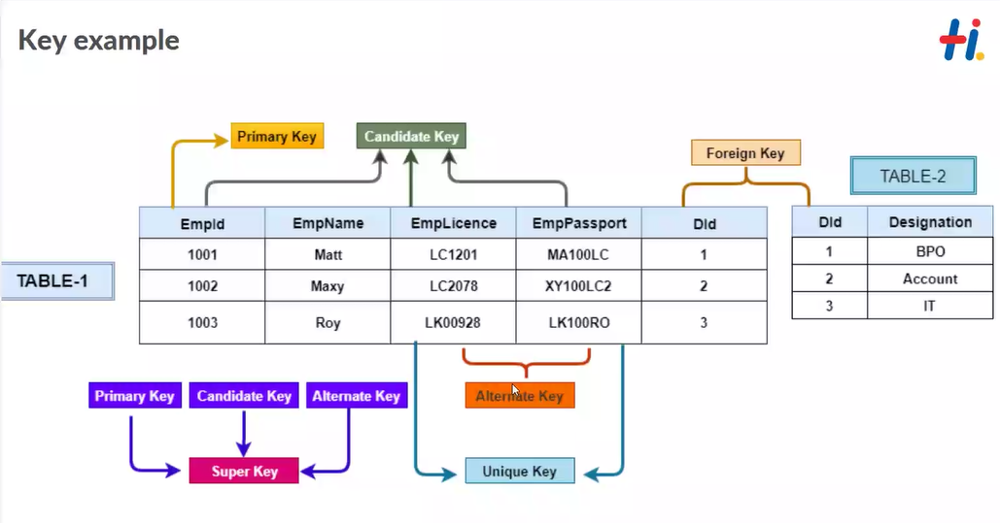
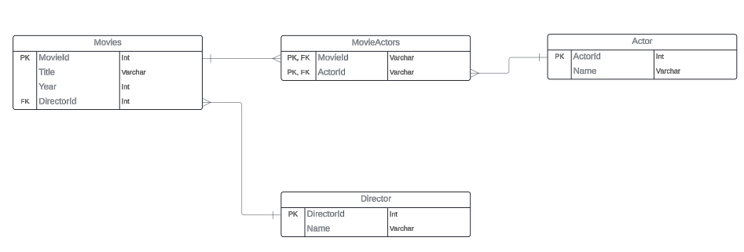

## Exercise 1 — Tasks

1. Find the title of each film

```sql
SELECT Title FROM movies;
```

2. Find the director of each film

```sql
SELECT Director FROM movies;
```

3. Find the title and director of each film

```sql
SELECT Title,Director FROM movies;
```

4. Find the title and year of each film

```sql
SELECT Title,Year FROM movies;
```

5. Find all the information about each film

```sql
SELECT * FROM movies;
```



## Exercise 2 — Tasks

1. Find the movie with a row id of 6

```sql
SELECT title FROM movies WHERE id=6;
```

2. Find the movies released in the years between 2000 and 2010

```sql
SELECT title FROM movies WHERE year BETWEEN 2000 AND 2010;
```

3. Find the movies not released in the years between 2000 and 2010

```sql
SELECT title FROM movies WHERE year NOT BETWEEN 2000 AND 2010;
```

4. Find the first 5 Pixar movies and their release year

```sql
SELECT title,year FROM movies LIMIT 5;
or
SELECT title,year FROM movies WHERE id BETWEEN 1 and 5;
```


## Exercise 3 — Tasks

1. Find all the Toy Story movies

```sql
SELECT * FROM movies WHERE title LIKE "Toy Story%";
```

2. Find all the movies directed by John Lasseter

```sql
SELECT title FROM movies WHERE director = "John Lasseter";
```

3. Find all the movies (and director) not directed by John Lasseter

```sql
SELECT title, director FROM movies WHERE director != "John Lasseter";
```

4. Find all the WALL-\* movies

```sql
SELECT title FROM movies WHERE title LIKE "WALL-%";
```



Note : Like is case insensitive, equalto is case sensitive
% - 0 or more, \_ is exactly 1

## Exercise 4 — Tasks

1. List all directors of Pixar movies (alphabetically), without duplicates

```sql
SELECT DISTINCT director FROM movies ORDER BY director; -- By default in ascending order
```

2. List the last four Pixar movies released (ordered from most recent to least)

```sql
SELECT title FROM movies ORDER BY year DESC LIMIT 4;
```

3. List the first five Pixar movies sorted alphabetically

```sql
SELECT title FROM movies ORDER BY title LIMIT 5;
```

4. List the next five Pixar movies sorted alphabetically

```sql
SELECT title FROM movies ORDER BY title LIMIt 5 OFFSET 5;
```


## Review 1 — Tasks

1. List all the Canadian cities and their populations

```sql
SELECT city,population FROM north_american_cities WHERE country="Canada";
```

2. Order all the cities in the United States by their latitude from north to south

```sql
SELECT city FROM north_american_cities WHERE country = "United States" ORDER BY latitude DESC;
```

3. List all the cities west of Chicago, ordered from west to east

```sql
SELECT city FROM north_american_cities ORDER BY longitude limit 6;

-- SELECT * FROM north_american_cities WHERE longitude < (select longitude from north_american_cities where city = "Chicago") order by longitude;
```

4. List the two largest cities in Mexico (by population)

```sql
SELECT city FROM north_american_cities WHERE country="Mexico" ORDER BY population desc LIMIT 2;
```

5. List the third and fourth largest cities (by population) in the United States and their population

```sql
SELECT city FROM north_american_cities WHERE country="United States" ORDER BY population desc LIMIT 2 OFFSET 2;
```


## Exercise 6 — Tasks

> Why we use only INNER JOIN?  
Because Left join is not possible as there will be no data of sales without the movies got released.
And Right Joinn is not needed as there will be no sales data when there are no corresponding movie.


1. Find the domestic and international sales for each movie

```sql
SELECT title, domestic_sales, International_sales
FROM Boxoffice as bo
INNER JOIN movies as mv
ON bo.Movie_id = mv.id;
```

2. Show the sales numbers for each movie that did better internationally rather than domestically

```sql
SELECT title, domestic_sales, International_sales
FROM Boxoffice as bo
INNER JOIN movies as mv
ON bo.Movie_id = mv.id
WHERE international_sales > domestic_sales;
```

3. List all the movies by their ratings in descending order

```sql
SELECT title, domestic_sales, International_sales 
FROM Boxoffice as bo 
INNER JOIN movies as mv 
ON bo.Movie_id = mv.id 
ORDER BY rating DESC;
```


## Exercise 7 — Tasks
1. Find the list of all buildings that have employees
```sql
SELECT DISTINCT building 
FROM employees;
```
2. Find the list of all buildings and their capacity
```sql
SELECT * FROM buildings;
```
3. List all buildings and the distinct employee roles in each 
building (including empty buildings)
```sql
SELECT Distinct building_name, role 
FROM buildings as bd
LEFT JOIN Employees as emp
ON bd.building_name = emp.building;
```


## Exercise 8 — Tasks
1. Find the name and role of all employees who have not been assigned to a building
```sql
SELECT name,role 
FROM employees
WHERE building IS NULL;
```
2. Find the names of the buildings that hold no employees
```sql
SELECT Distinct building_name, role 
FROM buildings as bd
LEFT JOIN Employees as emp
ON bd.building_name = emp.building WHERE role IS NULL;
```


## Exercise 9 — Tasks
1. List all movies and their combined sales in millions of dollars
```sql
SELECT Title, (Domestic_sales+International_sales)/1000000 as Combined_Sales
FROM movies as mv
INNER JOIN Boxoffice as bo
ON mv.Id = bo.Movie_id;
```
2. List all movies and their ratings in percent
```sql
SELECT Title, rating*10 as Ratings_in_Percentage
FROM movies as mv
INNER JOIN Boxoffice as bo
ON mv.Id = bo.Movie_id;
```
3. List all movies that were released on even number years
```sql
SELECT Title FROM movies WHERE Year%2==0;
```


Exercise 10 — Tasks
1. Find the longest time that an employee has been at the studio 
```sql
SELECT role, max(years_employed) as Longest_Time_in_Studio FROM employees;
```
2. For each role, find the average number of years employed by employees in that role
```sql
SELECT role,AVG(Years_employed) 
FROM employees 
WHERE Years_employed 
GROUP BY role;
```
3. Find the total number of employee years worked in each building
```sql

```
