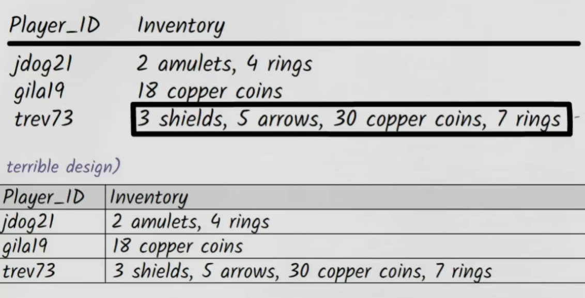
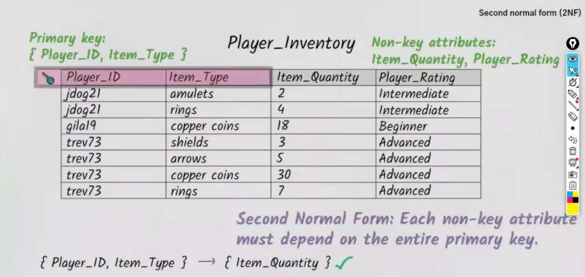
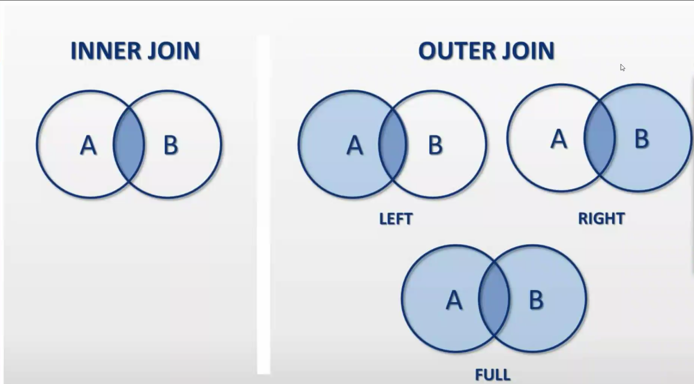

## What is a Database?

A Database is a software used to store data in any form.

## Why we need special software?

### Database lives in cloud

A cloud is a renting pc
Cloud Storage providers are not the cloud.
A server is a group of PC's

Linux is used in cloud

### Advantages of Linux

1. Free
2. Open-Source - All are travelling on the same boat, thats why its important
3. Security
4. Smaller footprint
5. Automation - Can be controlled all operations from the terminal, you wont even need a mouse.

Distro of linux :

- Linux Mint
- Ubuntu etc

## Features of Database

1. Database - Frequently asked data, it will have it in the ram
2. Querying becomes easy
3. CRUD - easy
4. Backups are inbuilt
5. Undo - easily (time limit)
6. Performance (As storing in the RAM)


# SQL Theory
## Keys

- Primary Key :
  1. Should be UNIQUE
  2. Should be NOT NULL
  3. Only one column a table should be PK
-

## Normalization

To avoid anomolies we do normalize the tables or
To increase the safety of the data

Types of Normal Forms:

1.  1st Normal Form
    
    Row order should not contain any information.
    Dont mix Data types within the same column
    Table without primarykey is not allowed
    Repeating groups are not permitted

    #### Task 1 (Convert to NF)
    

    player_id | Inventory | Quantity|
    -|-|-|
    abc|rings|2|
    xyz|shields|3|

    Primary Key - Combinely id and inventory (Composite Key)
    or else we can create a new primary key column.
    

2. 2nd Normal Form  
    Insertion, Updation & Deletion Anamoly  
    

    
    **Note - No partial Dependency (Non-key Attribute must depend on the entire Primary Key)**

3. 3rd Normal Form  
    Lesser updates, More safer data.
    
  (3.5 NF)BCNF - Every attribute should depend on Key attribute

## JOINS

```sql
-- Syntax
-- A JOIN B ON Pk = Fk;
```

