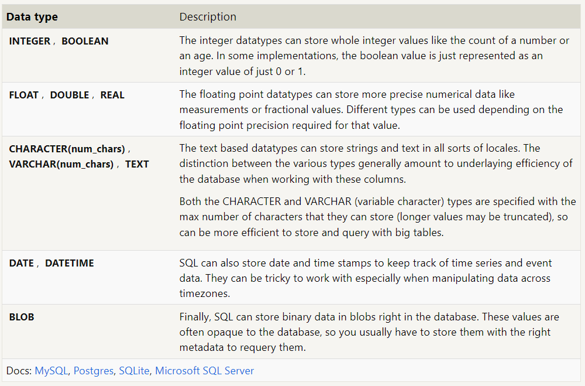
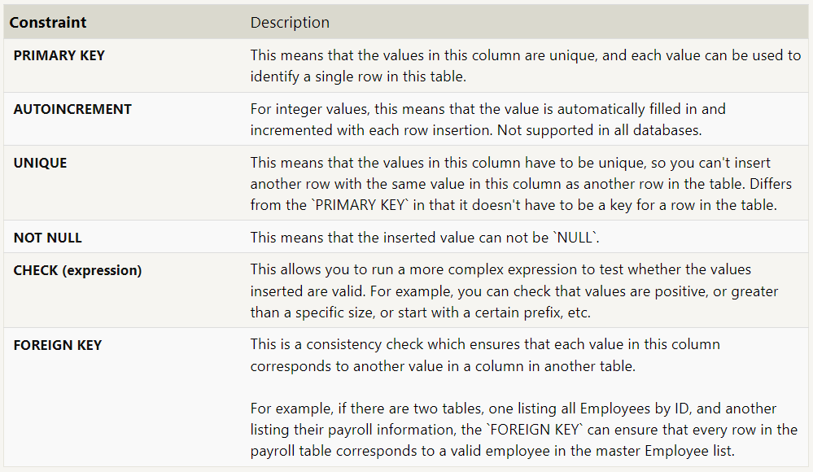
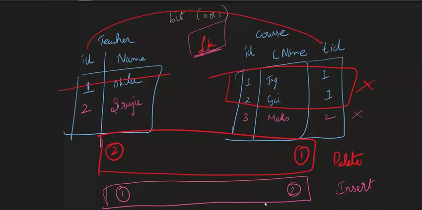

## Data Types


Data Type | Desc |
-| -|
INTEGER, BOOLEAN | For int it stores only whole numbers not decimals, Boolean stores 0 or 1
FLOAT, DOUBLE, REAL | Float - upto 3 decimal points, Double - 6, Real - 12
CHAR, VARCHAR, TEXT | Char - few chars (ex - gender), Varchar - Sentences, Text - paras
DATE, DATETIME | Only Date, Both Date & Time
BLOB | Binary data which can be used for anything 
```sql 
-- It is suggested to not Store in Database in the form of BLOB
-- We only store path of the file in the Database
```

| |INTEGER| |
|:-:|:-:|:-:|
INT|SMALLINT|BIGINT|
-2B,2B|-32K,32K|-9* 10<sup>8</sup>, 9*10<sup>8</sup>|


| |STRING||
|-|-|-|
VARCHAR| | nVARCHAR|
To store speacial char it takes as 2 chars | | To Store the same char it takes as only 1 char. Ex : U+123U+456 - It Supports multiple languages.
VARCHAR(max) - Instead of Text| |nVARCHAR(max) - Instead of Text


| | Decimal| |
-|-|-|
DECIMAL (Exact)| | FLOAT(Approx)
DECIMAL(10(Number System),2) Ex : 1234.6891 -> 1234.68| | Might lose few decimals when the precision is long(Rounds it off)
In decimal we will specify the precision | In FLOAT its fixed to Precision 3


Refer - learn.microsoft.com
# Constraints

## Why Constraints are needed?
To have the Data in a proper Format and have the Data Integrity(Honestness or correctness).

## Why Foreign Key is needed?
### Even though we dont have foreign key constraint, we can join the tables! Then why foreign key is needed?

- While inserting, it allows to insert the record only when there is a corresponding id(primary key)
- It throws an error when we try to insert record which doesn't exist in the primary key table.


## XML DataType
Tags/Elements - XML
Attributes are the things declared in elements

Inserting entire xml in that column


