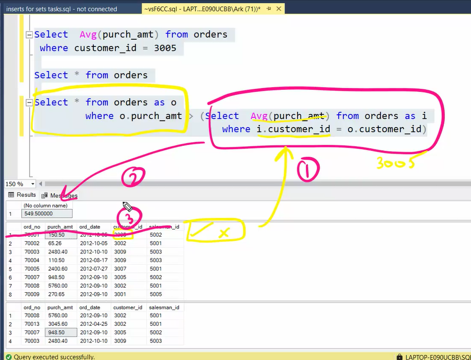

```sql
-- Table and its data
CREATE TABLE orders (
    ord_no INT PRIMARY KEY,
    purch_amt DECIMAL(10, 2),
    ord_date DATE,
    customer_id INT,
    salesman_id INT
);


INSERT INTO orders (ord_no, purch_amt, ord_date, customer_id, salesman_id) VALUES
(70001, 150.5, '2012-10-05', 3005, 5002),
(70009, 270.65, '2012-09-10', 3001, 5005),
(70002, 65.26, '2012-10-05', 3002, 5001),
(70004, 110.5, '2012-08-17', 3009, 5003),
(70007, 948.5, '2012-09-10', 3005, 5002),
(70005, 2400.6, '2012-07-27', 3007, 5001),
(70008, 5760, '2012-09-10', 3002, 5001),
(70010, 1983.43, '2012-10-10', 3004, 5006),
(70003, 2480.4, '2012-10-10', 3009, 5003),
(70012, 250.45, '2012-06-27', 3008, 5002),
(70011, 75.29, '2012-08-17', 3003, 5007),
(70013, 3045.6, '2012-04-25', 3002, 5001);

Select * from orders;
```

### Task 1
Find the average commision of a saleman from Paris
```sql
Select city,avg(commission) 
from salesman 
group by city 
having city='paris';
```
### Task 2
Find out if there are cities with only one salesman and list them | No nulls
Clue: Having
```sql
Select city 
from salesman
where city is not null
group by city
having count(city) = 1 ;
```
### Task 3 - Sub-Query
Write a query to display all the orders from the orders table issued by the salesman 'Paul Adam'.
```sql
Select * 
from orders as o
join salesman as s
on o.salesman_id = s.salesman_id
where s.name = 'Paul Adam';

-- Select * 
-- from orders
-- where salesman_id = (select salesman_id from salesman where name = 'Paul Adam');
```
### Task 4
Write a query to display all the orders which values are greater than the average order value for 10th October 2012
```sql
Select * 
from orders 
where purch_amt > (Select avg(purch_amt) as AVG_AMT 
                    from orders 
                    where ord_date = '2012-10-10'
);
```
### Task 5
Write a query to find all orders with order amounts which are above-average amounts for their customers.
```sql
Select * from orders as o
Where o.purch_amt > (Select Avg(purch_amt) from orders as od
						Where o.customer_id in( od.customer_id));

-- Select * from orders as o
-- Where o.purch_amt > (Select Avg(purch_amt) from orders as od
-- 						Where o.customer_id = od.customer_id);
```


### Task 6
Write a query to find all orders attributed to a salesman in 'Paris'
Clue: In operator
```sql
Select * 
from orders 
where salesman_id IN(select salesman_id 
                        from salesman 
                        where city in ('Paris')
);
```

### Task 7
Write a query to find the name and id of all salesmen who had more than one customer
```sql
select salesman_id, name 
from salesman 
where salesman_id IN(select salesman_id 
					from customer 
					group by salesman_id 
					having count(customer_id)>1
);
```